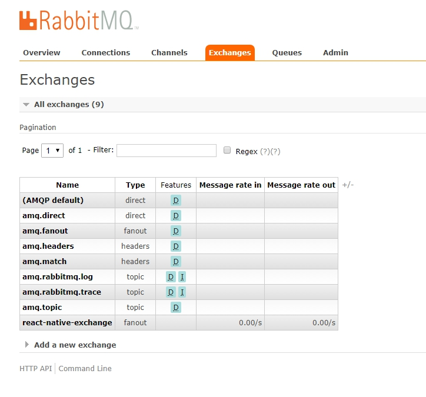
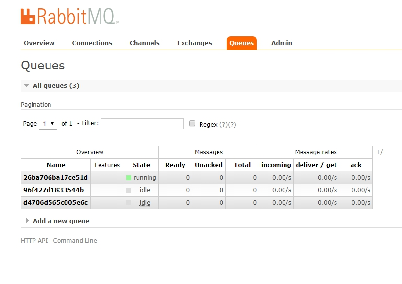
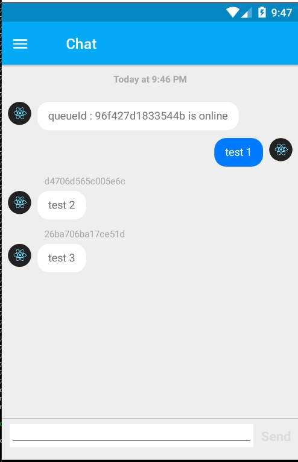
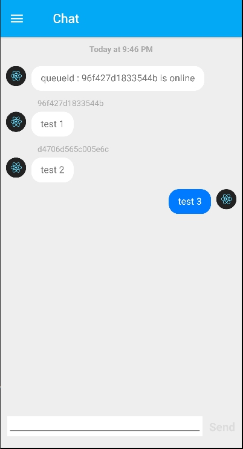

# RMChatApp

### version 0.0.2

### RabbitMq Server
# 

### User #1
# 

### User #2
# 

### User #3
# 

### Todo
  ##### - server api
  ##### - chat group
  ##### - chat per user
  ##### - chat history
